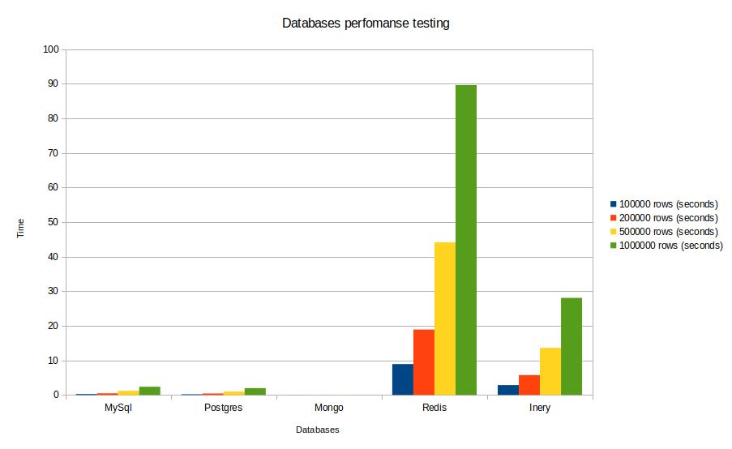

# Databases Statistics
### Measuring real statisctics from different database management systems

- ### MySql database table:
  ##### Create table SQL database query:
  ```CREATE TABLE users(userid INT NOT NULL AUTO_INCREMENT, fname VARCHAR(255), lname VARCHAR(255), email VARCHAR(255), gender VARCHAR(30), PRIMARY KEY(userid));```

- ### Postgres database table:
  ##### Create table SQL database query:
  ```CREATE TABLE users(userid SERIAL, fname VARCHAR(255), lname VARCHAR(255), email VARCHAR(255), gender VARCHAR(30), PRIMARY KEY(userid));```

- ### Mongo database:
  ##### Create mongo database:
    ```use usersdb```
  ##### Create mongo user:
    ```
    db.createUser({
        user: "root",
        pwd: "root",
        roles: [
           { role: "readWrite", db: "usersdb" }
        ]
      }
    )
    ```
  ##### Update mongo user for database:
    ```
    db.updateUser("root",{
        pwd: "root",
        roles: [
           { role: "readWrite", db: "usersdb" }
        ]
      }
    )
    ```
    
  ##### Create mongo collection:
    ```
    db.createCollection("users")
    ```

- ### Redis database:
    Use <***key***, ***value***> format
    ```
    <index, {
        "fname": "<user first name>",
        "lname": "<user last name>",
        "email": "<user email>",
        "gender": "<user gender>"
    }>
    ```

- ### Blockchain database:
  ###### Blockchain database based on Inery Blockchain System, using **value contract** written in **C++**
  ##### Steps for setting a value contract on the blockchain:
    **1.** *Compile C++ value contract*
    ```inery-cpp -abigen dbtest.cpp -o dbtest.wasm```
    
    **2.** *Create a key for a blockchain account*
    ```cline create key --to-console```
    
    **3.** *Create the blockchain account*
    ```
    cline system newaccount <blockchain create account name> <account name> <public key> <public key> 
    --stake-net="1 INR" --stake-cpu="1 INR" --buy-mem-bytes="1048576"
    ```
    
    **3.** *Unlock the blockchain wallet*
    ```cline wallet unlock --password <wallet_password>```
    
    **4.** *Import the account private key to the blockchain wallet*
    ```cline wallet import --private-key <private key>```
    
    **5.** *Set value contract on the blockchain account*
    ```cline set contract dbtest ./ dbtest.wasm dbtest.abi```
    
    **6.** *Buy resources for the blockchain account*
    ```
    cline push action inery buyresources '["inery", "<account name>", "<number of MBs> INR"]' -p inery@active
    ```
    
    **7.** *Push **insert** action to the value contract on the blockchain*
    ```
    cline push action <account name> insert '["<user first name>", "<user last name>", "<user email>", "<user gender>"]' -p <account name>@active
    ```
    
    **8.** *Push **update** action to the value contract on the blockchain*
    ```
    cline push action <account name> update '[<user id>, "<user first name>", "<user last name>", "<user email>", "<user gender>"]' -p <account name>@active
    ```
    
    **9.** *Push **delete** action to the value contract on the blockchain*
    ```
    cline push action <account name> remove '[<user id>]' -p <account name>@active
    ```
    
    **10.** *Preview the blockchain table **users** on the blockchain account*
    ```cline get table <account name> <account name> users```
    
    **11.** *Get number of rows for blockchain table **users** on the blockchain account*
    ```cline get scope <account name> -t users```
    
#### Install required python3 libraries
- MySql connector: **pip3 install mysql-connector-python**
- PostgreSql connector: **pip3 install psycopg2-binary**
- MongoDB connector: **pip3 install pymongo**
- Redis library: **pip3 install redis**

### Running scripts:
 - ### Run script for creating users and store them in users.json
  ```
  python3 create_users.py
  ```
  - ### Run script for filling the databases with users stored in users.json
  ```
  python3 databases_fill_data.py <parameter>
  ```
  **Use next parameters for different databases:**
  ```
  mysql [for MySql database]
  psql [for Postgres database]
  mongos [for Mongo database]
  redis [for Redis database]
  inery [for Inery blockchain database]
  ```
  - ### Run script for statistics to test the databases perfomanses and store results in statistics.json
  ```
  python3 databases_statistics.py <parameter>
  ```
  **Use next parameters for different databases:**
  ```
  mysql [for MySql database]
  psql [for Postgres database]
  mongos [for Mongo database]
  redis [for Redis database]
  inery [for Inery blockchain database]
  all [for all databases together]
  ```
  
### Perfomanse testing results:
```
{
      "MySql": {
            "100000": 0.2528102397918701,
            "200000": 0.473846435546875,
            "500000": 1.1869678497314453,
            "1000000": 2.368112564086914
      },
      "Postgres": {
            "100000": 0.20180678367614746,
            "200000": 0.4413423538208008,
            "500000": 0.9732499122619629,
            "1000000": 1.9828870296478271
      },
      "Mongos": {
            "100000": 9.274482727050781e-05,
            "200000": 1.7404556274414062e-05,
            "500000": 8.58306884765625e-06,
            "1000000": 7.62939453125e-06
      },
      "Redis": {
            "100000": 8.934781074523926,
            "200000": 18.909958362579346,
            "500000": 44.134650230407715,
            "1000000": 89.6202187538147
      },
      "Inery": {
            "100000": 2.8451430797576904,
            "200000": 5.737844228744507,
            "500000": 13.609675407409668,
            "1000000": 28.06069779396057
      }
}
```


### Conclusion:
[Databases Pefomanse Testing](DatabasePefomanseTesting.pdf)
